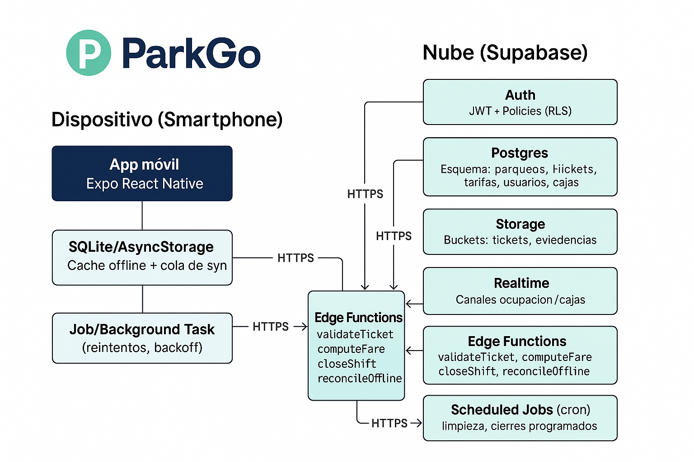

# ParkGo - Sistema de Estacionamiento

Sistema de gestión de estacionamiento desarrollado con React Native, Expo Router y TypeScript. Compatible con Expo Go para desarrollo y testing.

<a href="Documentación/" title="Ir a Documentación">
  
  <br/>
  <sub>Ver documentación completa</sub>
  
</a>

## 📹 Videos

### Video 1: Prompt utilizado para crear ParkGo

<a href="https://www.youtube.com/watch?v=QQy3W9XFA6E&t=71s" target="_blank">
  
</a>

**Enlace directo:** [Ver en YouTube](https://www.youtube.com/watch?v=QQy3W9XFA6E&t=71s)

---

### Video 2: MVP de ParkGo

<a href="https://www.youtube.com/watch?v=LAeGoit5DFw" target="_blank">
  
</a>

**Enlace directo:** [Ver en YouTube](https://www.youtube.com/watch?v=LAeGoit5DFw)

---

## 🚀 Características

- **Autenticación OTP por email** con Supabase
- **Gestión offline-first** con sincronización automática
- **CRUD completo** de tipos de vehículo y tarifas
- **Sistema de tickets** con entrada y salida
- **Cálculo automático de precios** con redondeo y tope diario
- **Impresión de tickets** vía expo-print (PDF/sistema)
- **Escaneo de códigos de barras** (HID y cámara)
- **Interfaz moderna** con NativeWind (Tailwind CSS)

## 📋 Requisitos

- Node.js 18+
- Expo CLI
- Expo Go app (iOS/Android)
- Cuenta de Supabase (opcional para sync)

## 🛠️ Instalación

1. **Clonar el repositorio**
   ```bash
   git clone <repository-url>
   cd parkgo
   ```

2. **Instalar dependencias**
   ```bash
   npm install
   ```

3. **Configurar variables de entorno**
   ```bash
   cp env.example .env
   ```
   
   Editar `.env` con tus credenciales de Supabase:
   ```
   EXPO_PUBLIC_SUPABASE_URL=tu_url_de_supabase
   EXPO_PUBLIC_SUPABASE_ANON_KEY=tu_clave_anonima_de_supabase
   EXPO_PUBLIC_APP_NAME=ParkGo
   EXPO_PUBLIC_APP_VERSION=1.0.0
   EXPO_PUBLIC_DEEP_LINK_SCHEME=parkgo
   ```

4. **Configurar Supabase**

   **4.1. Crear proyecto en Supabase**
   - Ve a [supabase.com](https://supabase.com)
   - Crea un nuevo proyecto
   - Copia la URL y la clave anónima a tu archivo `.env`

   **4.2. Configurar autenticación**
   - En el dashboard de Supabase, ve a **Authentication > Settings**
   - En **Site URL**, configura: `parkgo://auth/callback`
   - En **Redirect URLs**, agrega: `parkgo://auth/callback`
   - Habilita **Email** como proveedor de autenticación

   **4.3. Configurar la base de datos**
   Ejecuta el siguiente SQL en el **SQL Editor** de Supabase:

   ```sql
   -- Crear tabla de dispositivos
   CREATE TABLE IF NOT EXISTS devices (
     id TEXT PRIMARY KEY,
     business_name TEXT NOT NULL,
     ticket_header TEXT,
     location_name TEXT,
     printer_name TEXT,
     printer_address TEXT,
     scanner_mode TEXT CHECK (scanner_mode IN ('HID', 'CAMERA')) DEFAULT 'HID',
     updated_at DATETIME DEFAULT CURRENT_TIMESTAMP
   );

   -- Crear tabla de tipos de vehículo
   CREATE TABLE IF NOT EXISTS vehicle_types (
     id TEXT PRIMARY KEY,
     name TEXT UNIQUE NOT NULL,
     code TEXT UNIQUE NOT NULL,
     is_active BOOLEAN DEFAULT true,
     created_at DATETIME DEFAULT CURRENT_TIMESTAMP,
     updated_at DATETIME DEFAULT CURRENT_TIMESTAMP,
     device_id TEXT,
     version INTEGER DEFAULT 1,
     deleted BOOLEAN DEFAULT false
   );

   -- Crear tabla de planes de tarifa
   CREATE TABLE IF NOT EXISTS rate_plans (
     id TEXT PRIMARY KEY,
     name TEXT NOT NULL,
     currency TEXT DEFAULT 'USD',
     rounding_minutes INTEGER DEFAULT 15,
     daily_max REAL,
     active BOOLEAN DEFAULT true,
     created_at DATETIME DEFAULT CURRENT_TIMESTAMP,
     updated_at DATETIME DEFAULT CURRENT_TIMESTAMP,
     device_id TEXT,
     version INTEGER DEFAULT 1,
     deleted BOOLEAN DEFAULT false
   );

   -- Crear tabla de reglas de tarifa
   CREATE TABLE IF NOT EXISTS rate_items (
     id TEXT PRIMARY KEY,
     rate_plan_id TEXT NOT NULL REFERENCES rate_plans(id),
     vehicle_type_id TEXT NOT NULL REFERENCES vehicle_types(id),
     base_minutes INTEGER NOT NULL,
     base_price REAL NOT NULL,
     add_minutes INTEGER NOT NULL,
     add_price REAL NOT NULL,
     lost_ticket_fee REAL,
     created_at DATETIME DEFAULT CURRENT_TIMESTAMP,
     updated_at DATETIME DEFAULT CURRENT_TIMESTAMP,
     device_id TEXT,
     version INTEGER DEFAULT 1,
     deleted BOOLEAN DEFAULT false,
     UNIQUE(rate_plan_id, vehicle_type_id)
   );

   -- Crear tabla de tickets
   CREATE TABLE IF NOT EXISTS tickets (
     id TEXT PRIMARY KEY,
     status TEXT CHECK (status IN ('open', 'closed')) DEFAULT 'open',
     vehicle_type_id TEXT NOT NULL REFERENCES vehicle_types(id),
     plate TEXT NOT NULL,
     barcode TEXT,
     entry_time DATETIME NOT NULL,
     exit_time DATETIME,
     duration_minutes INTEGER,
     rate_plan_id TEXT NOT NULL REFERENCES rate_plans(id),
     total REAL,
     created_by TEXT,
     device_id TEXT,
     created_at DATETIME DEFAULT CURRENT_TIMESTAMP,
     updated_at DATETIME DEFAULT CURRENT_TIMESTAMP,
     synced_at DATETIME,
     version INTEGER DEFAULT 1,
     deleted BOOLEAN DEFAULT false
   );

   -- Crear tabla de pagos
   CREATE TABLE IF NOT EXISTS payments (
     id TEXT PRIMARY KEY,
     ticket_id TEXT NOT NULL REFERENCES tickets(id),
     method TEXT CHECK (method IN ('cash', 'card', 'digital')) DEFAULT 'cash',
     amount REAL NOT NULL,
     change REAL DEFAULT 0,
     created_at DATETIME DEFAULT CURRENT_TIMESTAMP,
     device_id TEXT,
     version INTEGER DEFAULT 1,
     deleted BOOLEAN DEFAULT false
   );

   -- Crear tabla de outbox para sincronización
   CREATE TABLE IF NOT EXISTS outbox (
     id TEXT PRIMARY KEY,
     table_name TEXT NOT NULL,
     row_id TEXT NOT NULL,
     op TEXT CHECK (op IN ('insert', 'update', 'delete')) NOT NULL,
     payload_json TEXT NOT NULL,
     retries INTEGER DEFAULT 0,
     last_error TEXT,
     created_at DATETIME DEFAULT CURRENT_TIMESTAMP
   );

   -- Crear índices
   CREATE INDEX IF NOT EXISTS idx_tickets_status ON tickets(status);
   CREATE INDEX IF NOT EXISTS idx_tickets_plate ON tickets(plate);
   CREATE INDEX IF NOT EXISTS idx_tickets_entry_time ON tickets(entry_time);
   CREATE INDEX IF NOT EXISTS idx_outbox_created_at ON outbox(created_at);
   CREATE INDEX IF NOT EXISTS idx_outbox_retries ON outbox(retries);
   ```

5. **Inicializar la base de datos**
   ```bash
   npm run start
   ```
   
   La app se inicializará automáticamente con datos de ejemplo.

## 🔐 Autenticación

La app incluye dos métodos de autenticación:

### 1. **Registro con Contraseña**
- Crea una cuenta nueva con email y contraseña
- Se guarda en Supabase Auth
- Envía email de confirmación automáticamente
- El usuario debe confirmar su email antes de poder iniciar sesión

### 2. **Inicio de Sesión con Contraseña**
- Accede con email y contraseña existentes
- Solo funciona después de confirmar el email
- Sesión persistente con tokens seguros

### Configuración de Deep Links
Para que funcione la confirmación de email, configura en Supabase:
- **Site URL**: `parkgo://auth/callback`
- **Redirect URLs**: `parkgo://auth/callback`
- **Email Confirmation**: Habilitado en Authentication > Settings

## 🚀 Desarrollo

### Iniciar el servidor de desarrollo
```bash
npm start
```

### Ejecutar en dispositivos
```bash
# Android
npm run android

# iOS
npm run ios

# Web
npm run web
```

### Ejecutar tests
```bash
# Una vez
npm test

# Modo watch
npm run test:watch
```

## 📱 Uso con Expo Go

1. **Instalar Expo Go** en tu dispositivo móvil
2. **Escanear el QR** que aparece en la terminal
3. **La app se cargará** automáticamente en Expo Go

### Funcionalidades disponibles en Expo Go:
- ✅ Autenticación OTP
- ✅ Gestión de tickets offline
- ✅ Cálculo de precios
- ✅ Escaneo de códigos de barras
- ✅ Impresión vía expo-print
- ✅ Sincronización (requiere Supabase)

## 🏗️ Arquitectura

### Estructura del Proyecto
```
app/
├── (auth)/           # Pantallas de autenticación
├── (tabs)/           # Navegación principal
├── entry/            # Nueva entrada
├── exit/             # Cobrar salida
├── tickets/          # Gestión de tickets
├── settings/         # Configuración
├── sync/             # Sincronización
└── modals/           # Modales (escáner)

components/
├── ui/               # Componentes reutilizables
└── ...               # Otros componentes

services/
├── auth.ts           # Autenticación Supabase
├── pricing.ts        # Cálculo de precios
├── print.ts          # Impresión de tickets
├── scanner.ts        # Escaneo de códigos
└── sync.ts           # Sincronización offline

store/
├── authSlice.ts      # Estado de autenticación
├── ticketsSlice.ts   # Estado de tickets
├── ratesSlice.ts     # Estado de tarifas
└── ...               # Otros slices

db/
├── schema.ts         # Esquema de base de datos
├── client.ts         # Cliente SQLite
└── seed.ts           # Datos iniciales
```

### Base de Datos (SQLite)
- **vehicle_types**: Tipos de vehículo
- **rate_plans**: Planes de tarifas
- **rate_items**: Reglas de precios por tipo
- **tickets**: Tickets de entrada/salida
- **payments**: Pagos procesados
- **devices**: Configuración del dispositivo
- **outbox**: Cola de sincronización

## 🎨 Personalización

### Colores del Tema
Los colores están definidos en `constants/theme.ts`:
- **Primario**: #50DB7B (verde)
- **Secundario**: #3C4372 (azul oscuro)
- **Fondo**: #EDEEFF (azul claro)
- **Texto**: #737497 (gris)

### Configuración de Impresión
- **Formato**: 80mm (térmico)
- **Método**: expo-print → PDF → expo-sharing
- **Configuración**: `services/print.ts`

### Modos de Escaneo
- **HID**: TextInput siempre enfocado (lector de anillo)
- **Cámara**: expo-barcode-scanner para QR/códigos de barras
- **Configuración**: `app/settings/device.tsx`

## 🔄 Sincronización

### Offline-First
- Todas las operaciones se guardan localmente
- Cambios se encolan en `outbox`
- Sincronización manual o automática

### Política LWW (Last Write Wins)
- En caso de conflicto, gana el servidor
- Timestamps determinan la versión más reciente
- Soft delete para mantener historial

### Configuración de Sync
```typescript
// services/sync.ts
export const syncAll = async () => {
  // 1. Push cambios locales
  await pushOutbox();
  
  // 2. Pull cambios del servidor
  await pullChanges();
};
```

## 🧪 Testing

### Ejecutar Tests
```bash
npm test
```

### Tests Disponibles
- **pricing.test.ts**: Cálculo de precios
- **auth.test.ts**: Autenticación (próximamente)
- **sync.test.ts**: Sincronización (próximamente)

### Mocking
- Expo modules mockeados en `jest.setup.js`
- Supabase client mockeado
- SQLite database mockeada

## 📦 Despliegue

### Build para Producción
```bash
# Android
expo build:android

# iOS
expo build:ios
```

### Configuración de Producción
1. **Actualizar variables de entorno**
2. **Configurar Supabase** para producción
3. **Configurar impresoras** térmicas
4. **Probar sincronización** en red real

## 📚 Documentación

- Accede al directorio de documentación en `Documentación/` para guías, decisiones técnicas y troubleshooting.

## 🐛 Troubleshooting

### Problemas Comunes

**Error de permisos de cámara**
- Verificar configuración en `app.json`
- Reiniciar Expo Go
- Verificar permisos del dispositivo

**Error de sincronización**
- Verificar credenciales de Supabase
- Verificar conexión a internet
- Revisar logs en `services/sync.ts`

**Error de impresión**
- Verificar configuración de impresora
- Probar con PDF primero
- Verificar permisos de archivos

### Logs de Debug
```bash
# Habilitar logs detallados
EXPO_DEBUG=1 npm start
```

## 🤝 Contribución

1. Fork el proyecto
2. Crear feature branch (`git checkout -b feature/nueva-funcionalidad`)
3. Commit cambios (`git commit -m 'Agregar nueva funcionalidad'`)
4. Push al branch (`git push origin feature/nueva-funcionalidad`)
5. Abrir Pull Request

## 📄 Licencia

Este proyecto está bajo la Licencia MIT. Ver `LICENSE` para más detalles.

## 📞 Soporte

- **Issues**: GitHub Issues
- **Documentación**: `Documentación/`
- **Email**: soporte@parkgo.com

---

**ParkGo** - Sistema de Estacionamiento Inteligente 🚗💨